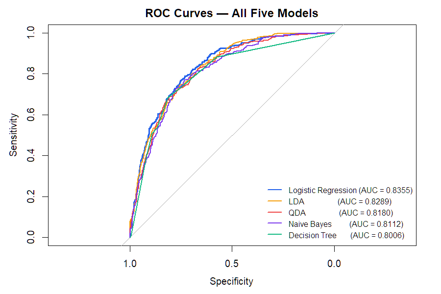
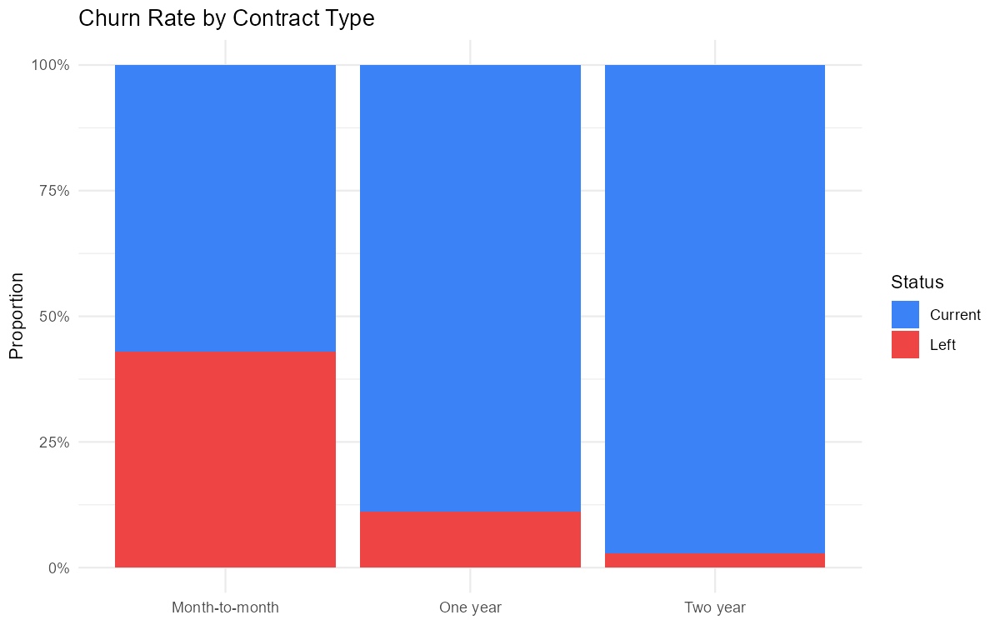
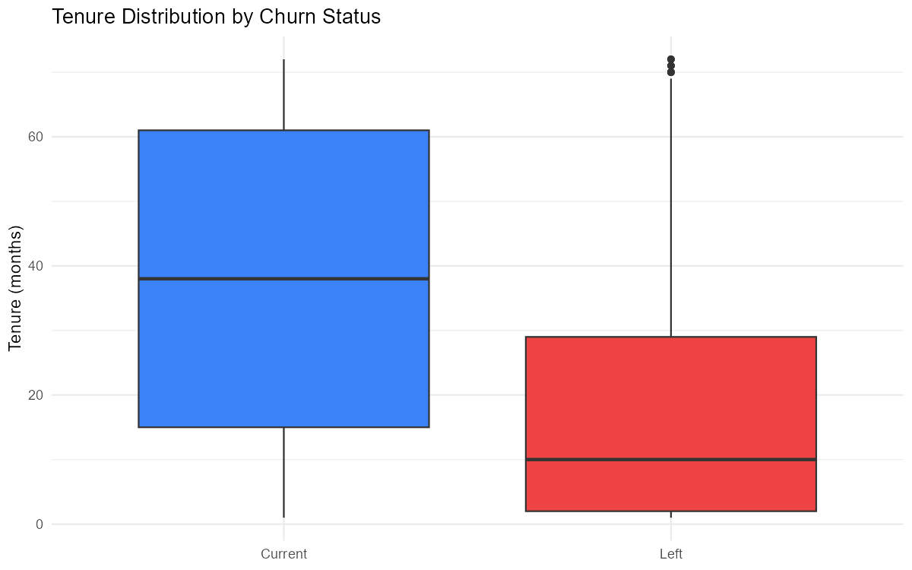

# Telecom Customer Churn — Predictive Modeling & Retention Strategy


---

## The Business Problem

A telecom company losing 25–30% of customers annually needs to know
two things before it can act: which customers are about to leave,
and what does it cost to keep them versus replace them?

This project answers both. Five classification models were built,
compared, and then the best one was deployed against a new batch
of 500 customers to produce actual revenue figures — not just
accuracy metrics.

---

## Results

**74 customers** flagged as churn risk out of 500 analyzed.

| Metric | Value |
|--------|-------|
| Monthly revenue at risk | $6,158 |
| Incentive cost (short-term) | $2,220 |
| Net benefit if retained | $3,938 |
| ROI on incentive spend | 177% |
| Loyalty program net benefit | $128,574 |

---

## What Drives Churn

Five factors from logistic regression odds ratios:

| Factor | Effect |
|--------|--------|
| Fiber optic internet | 3x more likely to churn than DSL |
| Month-to-month contract | Highest risk segment |
| Electronic check payment | 1.42x higher churn odds |
| Two-year contract | 80% less likely to churn |
| Tenure (each additional month) | Reduces churn probability |

Contract type is the single most actionable lever.
Moving a customer from month-to-month to a two-year contract
reduces their churn probability by 80%.

---

## Model Performance

| Model | AUC | Best Accuracy | Threshold |
|-------|-----|---------------|-----------|
| **Logistic Regression** | **0.8355** | **79.57%** | **0.6** |
| LDA | 0.8289 | 79.11% | 0.6 |
| QDA | 0.8180 | 78.10% | 0.9 |
| Naive Bayes | 0.8112 | 77.10% | 0.9 |
| Decision Tree (Pruned) | 0.8006 | 78.95% | 0.5 |

Logistic regression was selected — it leads on both AUC and accuracy,
and its coefficients read directly as odds ratios, which gives a
retention team something concrete to act on.

---

## Screenshots

**ROC Curves — All Five Models**


**Churn by Contract Type**


**Tenure Distribution**


---

## Project Structure

```
telecom-churn-prediction/
├── analysis/
│   ├── churn_analysis.Rmd     ← full analysis with business framing
│   ├── churn_analysis.html    ← rendered output (open in browser)
│   └── README.md
├── docs/
│   └── screenshots/
│       ├── roc_curves.png
│       ├── churn_distribution.png
│       ├── tenure_vs_churn.png
│       └── contract_churn_rate.png
├── data/
│   └── README.md
└── README.md
```

---

## Setup

### 1. Install R and RStudio

R: https://cran.r-project.org

RStudio: https://posit.co/download/rstudio-desktop/

Install R first, then RStudio.

### 2. Get the Data

See [data/README.md](data/README.md) for the Kaggle download link.
Place `telecom_churn.csv` (or the `.rda` files if available) in `data/`.

### 3. Install R Packages

```r
install.packages(c(
  "tidyverse", "caret", "ggplot2", "pROC",
  "e1071", "MASS", "naivebayes",
  "rpart", "rpart.plot"
))
```

### 4. Run

Open `analysis/churn_analysis.Rmd` in RStudio.
Click **Knit → Knit to HTML**.

Or open `analysis/churn_analysis.html` directly in a browser —
no R installation required to read the results.

---

## Troubleshooting

| Problem | Fix |
|---------|-----|
| `there is no package called 'naivebayes'` | `install.packages("naivebayes")` |
| `cannot open file 'Model_Building_Data.rda'` | Place the `.rda` files in the same folder as the `.Rmd` |
| Knit fails | Check the Console — usually a missing package |

---

## Tech Stack

R · tidyverse · ggplot2 · caret · pROC · MASS · naivebayes · rpart

---

## Author

**Adarsh Shukla**
MS Business Analytics · University of Dayton
[LinkedIn](https://linkedin.com/in/adarshhshukla) ·
[GitHub](https://github.com/alsoadarsh)
